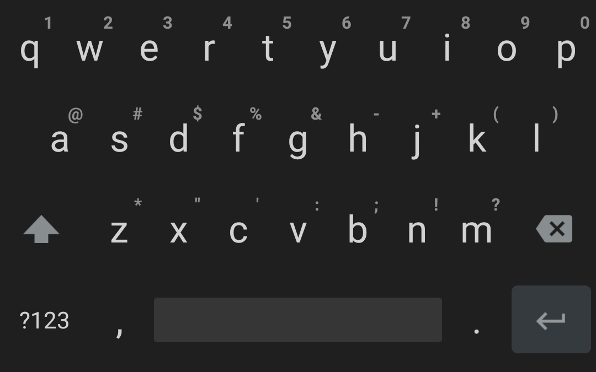

# TEL-Keyboard

      

## Changes:
- add BroadcastReceiver to change background color from other apps: `am broadcast --user 0 -a com.tel.keyboard.inputmethod.THEME com.tel.keyboard.inputmethod --es color "#1f1f1f"`
- swipe to delete and select is enabled by default
- vibration on keypress is disabled by default
- background color of dark themes is: `#1f1f1f`

## Credits:

Fork of [Simple Keyboard](https://github.com/rkkr/simple-keyboard)

Licensed under Apache License Version 2

This keyboard is based on AOSP LatineIME keyboard. You can get the original source code in https://android.googlesource.com/platform/packages/inputmethods/LatinIME/
